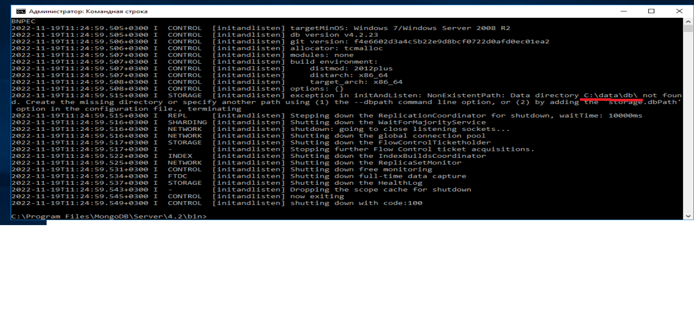
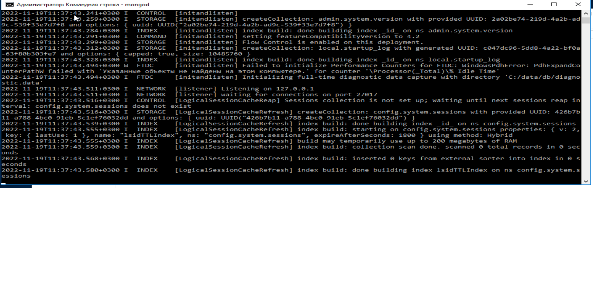
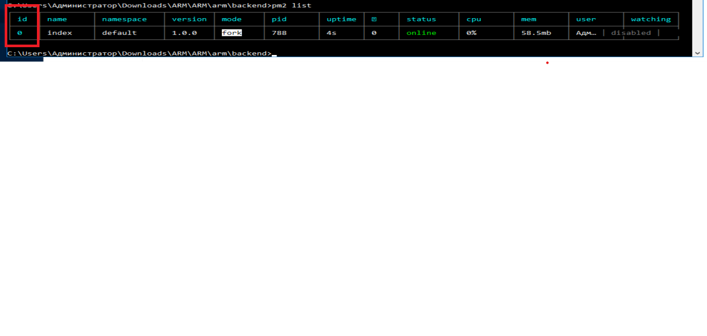
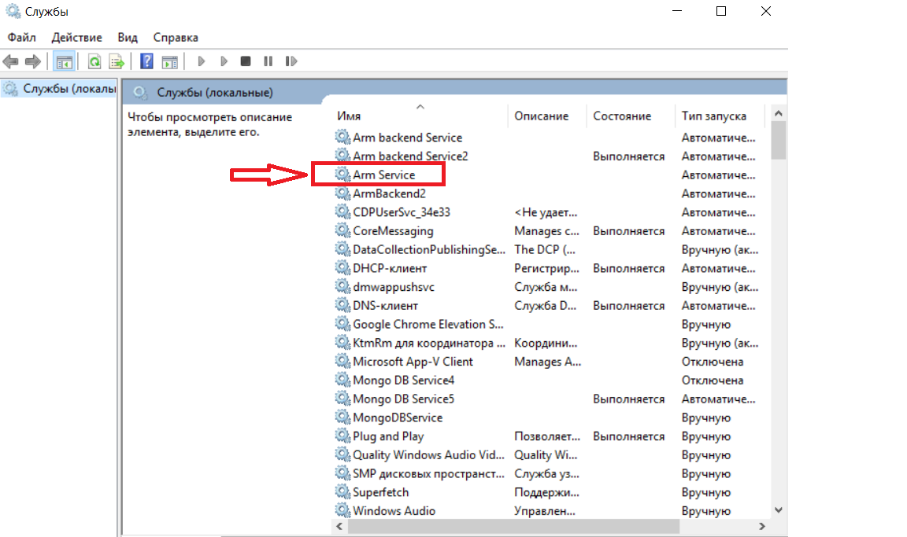

# Инструкция по установке приложения "Стрела"

## 1) установка базы MongoDB

### 1.1) подготовка 

Проверить версию базы MongoDB на исходном сервере
````
mongo -version
MongoDB shell version v4.2.0
````

На текущий момент найти версию v4.2.0 на официальном сайте невозможно.
Доступна версия 4.2.23.

Скачать инстолятор Mongo DB для Windows X64 можно по [ссылке](https://fastdl.mongodb.org/win32/mongodb-win32-x86_64-2012plus-4.2.23-signed.msi)

Скачать субд Mongo DB других версий или под другие ОС можно по [ссылке]()

### 1.2) установка

Устанавливаем MSI как обычную программу Windows.

### 1.3) настройка каталога хранения данных

По умолчанию установка в Windows проходит в каталог C:\Program Files\MongoDB
Переходим в каталог C:\Program Files\MongoDB\Server\4.2\bin
Пытаемся выполнить команду
````
mongod
````


C:\data\db каталог в котором нужно создать для хранения базы.
Если этот путь не устраивает необходимо внести исправления в 
файле C:\Program Files\MongoDB\Server\4.2\bin\mongod.cfg

Создал папку C:\data\db

выполняю 
````
mongod
````



Ошибки нет MongoDB запускается.
Закрываем консоль, MongoDB останавливается.

#### 1.4) создаем Service Mongo DB 

````
sc create MongoDBService binPath="\"C:\Program Files\MongoDB\Server\4.2\bin\mongod.exe\" --service"
DisplayName="MongoDB Service" type=own start=auto
[SC] CreateService: успех
````
Далее ставим созданный сервис на запуск при включении системы и настраиваем перезапуск в случае ошибки.

#### 1.5) создание бекапа Mongo DB
Переходим на старый сервер 77.91.196.172.
Перед снятием бекапа лучше остановить приложение Node Js. 
Это будет гарантировать что записи не будут потеряны.
Базу останавливать не нужно, только приложение.
Но можно и не оcтанавливать приложение.

#### 1.5.1) останавливаем приложение если это нужно
Сейчас приложение останавливается командой
````
pm2 stop 0
````
0 - это идентификатор приложения в листе pm2, может быть другой ID приложения.
Посмотреть все приложения в pm2 можно командой
````
pm2 list
````


##### 1.5.2) снимаем бекап MongoDB
Создаем каталог для хранения бекапа
C:\Program Files\MongoDB\backup

переходим в каталог C:\Program Files\MongoDB\Server\4.2\bin\

Запускаем команду для создания бекапа базы
````
mongodump.exe -oplog -o "C:\Program Files\MongoDB\backup"
````
В каталоге C:\Program Files\MongoDB\backup должен сохраниться бекап всей базы MongoDB.
Примерный размер бекапа базы 16-17 Мб.

##### 1.5.3) мигрируем бекап MongoDB

Копируем каталог C:\Program Files\MongoDB\backup на новый сервер.

##### 1.5.4) разворачиваем бекап MongoDB

переходим в каталог bin базы MongoDB из п.1.3.
В нашем случае это директория C:\Program Files\MongoDB\Server\4.2\bin.
Убедимся, что база запущена выполняем команду 
````
mongo
````
Если удалось войти в консоль MongoDB то база работает, если нет нужно запустить MongoDB.
Выходим из консоли базы.
````
exit;
````
Запускаем команду разворота бекапа, где указываем путь для каталога с бекапом
````
mongorestore.exe C:\backup;
````

##### 1.5.5) проверяем данные

после завершения разворота бекапа, проверяем что данные появились
переходим в каталог bin базы MongoDB из п.1.3.
В нашем случае это директория C:\Program Files\MongoDB\Server\4.2\bin.
````
mongo
````
Мы зашли в консоль базы MongoDB
Выполняем команду
````
show dbs;
````
в результате мы увидим список баз, которые мы развернули из бекапа
[](readme-images/mongo-show-dbs.png)
Если мы увидели в списке базу arm, радуемся: база развернулась!

Проверим данные, выполним 
````
use arm;
````
````
show collections;
````
Если все прошло хорошо, то мы увидим три коллекции
[](readme-images/mongodb-check-collections.png)
Посмотрим количество записей в каждой коллекции
````
db.users.count();
````
````
db.orders.count();
````
````
db.payrolls.count();
````
Если все всех коллекциях строк больше 0, значит данные развернулись.
Будет хорошо, если получится сравнить количество строк на исходной БД и целевой.

База развернута, можем идти далее.

## 2) установка Node JS

Проект можно оставить на версии Node JS 10.16.3, но тогда не будет работать автозапуск приложения.
Я протестировал работу на версии Node JS 12.13.0. Приложение также стабильно работает на этой версии.
Также для версии Node JS 12.13.0 возможно создать Windows сервис для запуска приложения.

### 2.1) подготовка к установке Node JS (одинаково для 10.16.3 и 12.13.0)

Проверяем версии на исходном сервере
node -v
v10.16.3
npm -v
v6.9.0

Скачать msi инстолятор node js v 10.16.3 можно по [ссылке](https://nodejs.org/ca/blog/release/v10.16.3/)

Скачать msi инстолятор node js v 12.13.0 можно по [ссылке](https://nodejs.org/ca/blog/release/v12.13.0/)

### 2.1) установка Node js (одинаково для 10.16.3 и 12.13.0)

Устанавливаем одну из версий MSI как обычную программу Windows.

После установки перезагружаем систему. Проверяем установленную версию Node Js и npm.
(npm - установщик пакетов и зависимостей)

````
node -v
````
v12.13.0
````
npm -v
````
6.12.0

## 3) установка приложения (одинаково для 10.16.3 и 12.13.0)

### 3.1) Исходный код  (одинаково для 10.16.3 и 12.13.0)

Скачиваем исходники для проекта на новый сервер.
Проверяем отсутствие каталогов node_modules в папках frontend и backend.
Если каталоги присутствуют, то удаляем их. 
Нужно чтобы Node Js скачал зависимости конкретно по текущую OC.

### 3.2) Установка проектных зависимостей (одинаково для 10.16.3 и 12.13.0)

### 3.2.1) Переходим в каталог frontend проекта

запускаем команду
````
npm install
````
Исправляем ошибки совместимости пакетов
````
npm audit fix
````
Собираем frontend проекта, следующей командой
````
npm run build
````
После выполнения этой команды должна появиться папка build

### 3.2.2) Переходим в каталог backend проекта

запускаем команду
````
npm install
````
Исправляем ошибки совместимости пакетов
````
npm audit fix
````

### 3.3) Установка проектных зависимостей (для 10.16.3)

Переходим в каталог arm проекта(который содержит каталоги frontend и backend) запускам команду
````
npm install pm2 -g
````

### 3.3) Установка проектных зависимостей (для 12.13.0)

Переходим в каталог arm проекта(который содержит каталоги frontend и backend) запускам команду
установки web сервера
````
npm install pm2 -g
````

Запускаем установку менеджера служб
Переходим в каталог arm проекта(который содержит каталоги frontend и backend) запускам команду
````
npm install node-windows -g
````

### 3.4) Установка проектных зависимостей (для 12.13.0)

Переходим в каталог arm проекта(который содержит каталоги frontend и backend) запускам команду.

Создаем службу для запуска проекта следующей командой
````
node install-windows-service.js
````

Проверяем в службах наличие службы с именем "Arm Service"


Запускаем службу, проверяем что у нас запустился проект.
Если проект запустился ставил на автозапуск службу.